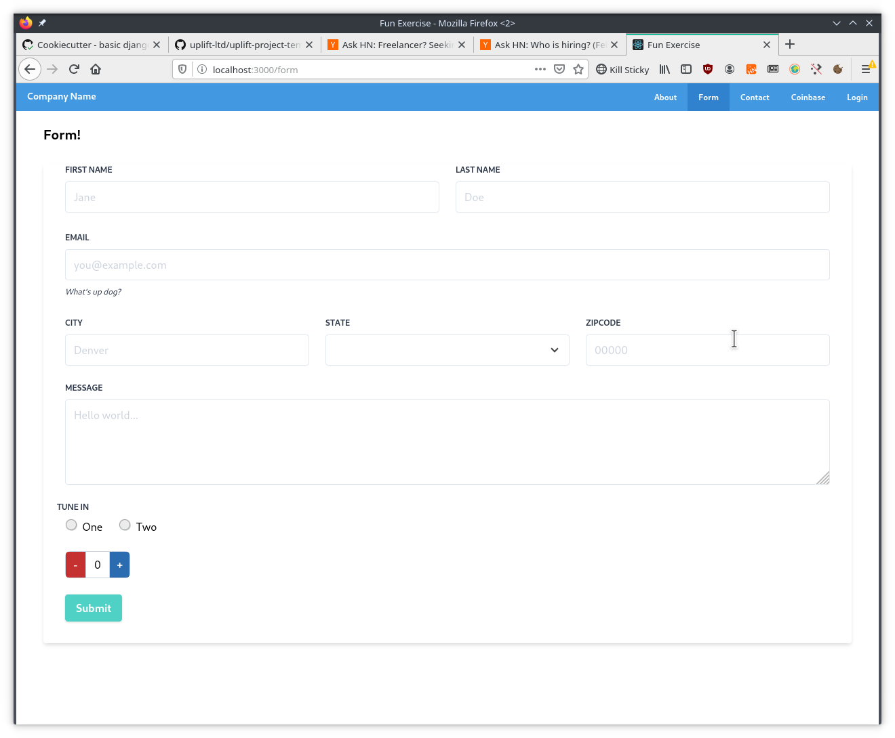

# Flask Unchained Exercise

## Frontend

* TypeScript CRA with GraphQL via Apollo Boost
* Formik
* React Router
* Tailwind CSS

The FE is structured similarly to Hotspring. It includes a basic App Layout with a boilerplate AppContext pre-wired for authentication (currentUser).

URLs are defined and mapped to their components in [routes.ts](https://github.com/briancappello/fun-exercise/blob/master/src/routes.ts)

A sample form with (most) inputs looks like [this](https://github.com/briancappello/fun-exercise/blob/master/src/pages/SampleForm.tsx) (yup validation is commented out but works as expected when enabled)
    - The actual [form input components](https://github.com/briancappello/fun-exercise/tree/master/src/components/Form) have been refactored from what Hotspring used to wrap `Formik.Field` so that it's use is no longer directly required.

[Tailwind CSS](https://tailwindcss.com/) is used for styles. I spent a bit of time playing around with it but not a ton.
    - hot reloading doesn't seem to work specifically when editing `src/index.tailwind.css` (possibly just missing a watch flag in package.json or some such?)
    - the custom tailwind directives (functions? macros? postcss features) only seem to work in `index.tailwind.css` (as opposed to in the stylesheets for individual components).

The mostly default style looks like this:

